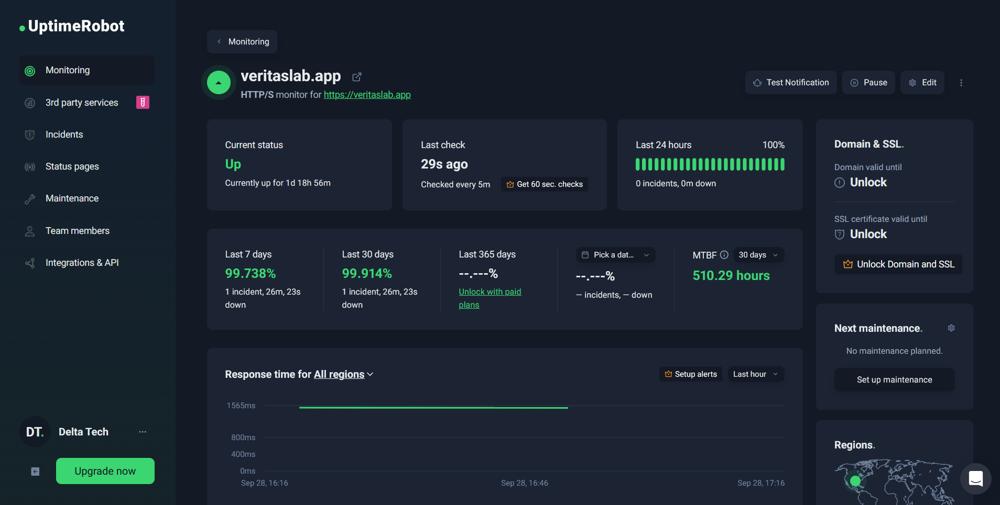
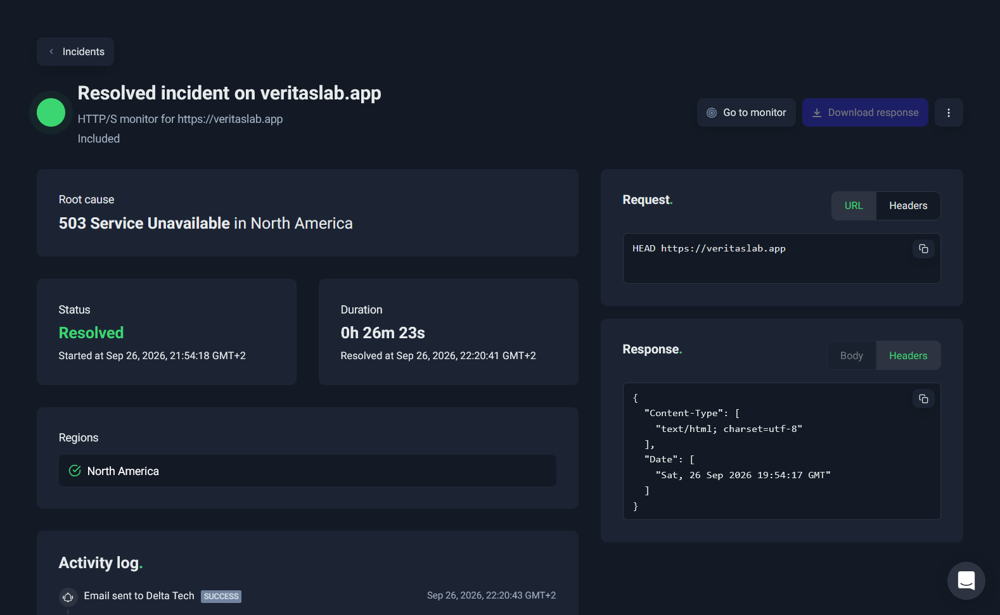
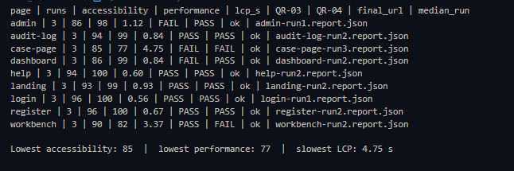

# NFR Testing

Each quality requirement from the [Non-Functional Requirements](Non_Functional_Requirements.md) has at least one executable, repeatable test. This page gives, for each requirement:
- its test and the architectural tactic it verifies;
- the command to reproduce it;
- the measured result;
- screenshots (`imgs/`) and raw tool output (`evidence/`).

Every command is also listed in [`nfr/README.md`](../../nfr/README.md).

## Results summary

| ID | Target | Actual |
|---|---|---|
| [QR-01](#qr-01--performance-under-load) | p95 latency for `GET /api/getCases` < 300 ms at 300 concurrent users | 500ms |
| [QR-02](#qr-02--availability) | ≥ 99.9% uptime | **99.918%** |
| [QR-03](#qr-03--accessibility) | Every page ≥ 90 | 6 of 9 pages; lowest 85 |
| [QR-04](#qr-04--performance-page-load) | Every page ≥ 90 and LCP ≤ 2.5 s | 7 of 9 pages; lowest 77, LCP 4.75 s |
| [QR-05](#qr-05--maintainability-test-coverage) | Total line coverage ≥ 85% | Total line coverage:  |
| [QR-06](#qr-06--reliability-recoverability) | Detect ≤ 5 min; MTTR ≤ 5 min in 3/3 drills and all real incidents | | 
| [QR-07](#qr-07--security-password-protection) | 100% bcrypt cost ≥ 12; 0 leaks; HttpOnly + Secure | 4/4 bcrypt cost 12; 0 of 5 responses; 0 of 31 routes; 3/3 cookies | 

## 3.3.1 Quality Requirement Mapping

| Quality requirement | Architectural decision (tactic) |
|---|---|
| QR-01: p95 latency for `GET /api/getCases` < 300 ms at 300 concurrent users | Async FastAPI + asyncpg connection pool (min 5, max 30 connections), `Backend/app/api/main.py` |
| QR-02: ≥ 99.9% uptime of `veritaslab.app` | External ping/echo monitoring (UptimeRobot, 5-minute multi-region HTTP(S) checks with email alerts); automated rollback job in Main CD when a production deployment fails (`.github/workflows/Main-CD.yml`) |
| QR-03: every page ≥ 90 Lighthouse accessibility | Semantic markup, labelled form components and a design-token colour system (`frontend/src/styles/globals.css`) in the Next.js presentation layer |
| QR-04: every page ≥ 90 Lighthouse performance, LCP ≤ 2.5 s | Next.js server-side rendering and route-level code-splitting; lazy-loaded evidence thumbnails |
| QR-05: ≥ 85% line coverage for backend and frontend separately | White-box unit testing (pytest, Jest) and a regression suite that must pass on every PR (the `dev` branch ruleset requires 5 CI checks); object storage behind boto3's S3-compatible interface, so it can be swapped out in tests |
| QR-06: outages detected ≤ 5 min, MTTR ≤ 5 min | Ping/echo detection and alerting (UptimeRobot); Azure App Service container restart; Main CD rollback job and manual redeploy through `workflow_dispatch` |
| QR-07: 100% bcrypt cost ≥ 12; no password, hash or token in any response or URL; HttpOnly + Secure cookie | bcrypt one-way password hashing at cost 12 (`Backend/app/auth/auth.py`); JWT carried only in an HttpOnly, Secure cookie |

## Test environments

| Environment | Used for | Details |
|---|---|---|
| Local `docker compose` | QR-05, QR-07 | Same Dockerfiles as production; Postgres 18, MinIO |
| Dev Azure `https://veritas-lab-dev.azurewebsites.net` | QR-01, QR-03, QR-04, QR-06 drills | Azure App Service in **South Africa North**, running the same Docker images as production (built by Dev CD); R2 object storage |
| Production `https://veritaslab.app` | QR-02, QR-06 incidents, QR-07 cookie check | Monitored by UptimeRobot; only read-only checks run against it, so testing never causes a production outage |

Pinned tool versions: pytest 9.0.3, pytest-cov 7.1.0, Jest 30, Lighthouse 12.8.2, puppeteer-core 24, Locust 2.46.4, UptimeRobot API v2.

---

## QR-01 – Performance under load

| | |
|---|---|
| **Requirement** | p95 latency for `GET /api/getCases` below **300 ms** at **300 concurrent users**. |
| **Demo 3 target** | < 400 ms at 300 users. |
| **Tactic** | Async FastAPI + asyncpg connection pool (min 5, max 30), `Backend/app/api/main.py`. |
| **Tool** | Locust 2.46.4: [`nfr/performance/locustfile.py`](../../nfr/performance/locustfile.py). It logs in once and shares that session across all simulated users, and each user waits 1–3 s between requests. |
| **Environment** | Dev Azure (South Africa North), with load generated from South Africa, where the users are |

**How to reproduce**
```bash
read -r -p "Email: " LOCUST_EMAIL; read -rs -p "Password: " LOCUST_PASSWORD; echo; export LOCUST_EMAIL LOCUST_PASSWORD
Backend/venv/Scripts/python.exe -m locust -f nfr/performance/locustfile.py --headless -u 300 -r 30 -t 5m   --csv Docs/Demo_4/evidence/QR-01 --html Docs/Demo_4/evidence/QR-01-locust-report.html
```

**Result**

| Target | Actual |
|---|---|
| < 300 ms | 500ms |

**Evidence** 


Raw output: [`evidence/QR-01-locust-report.html`](evidence/QR-01-locust-report.html), [`evidence/QR-01_stats.csv`](evidence/QR-01_stats.csv)

---

## QR-02 – Availability

| | |
|---|---|
| **Requirement** | `https://veritaslab.app` is up **≥ 99.9%** of the monitored window (the last 30 days, or since monitoring began). |
| **Demo 3 target** | ≥ 99.5% over 30 days, from a GitHub Actions schedule. The result was 97.261%, a miss. |
| **Why this is stricter** | 99.9% allows 43 minutes of downtime per 30 days instead of 3.6 hours. Uptime is computed only over the days actually monitored. UptimeRobot's own 30-day figure (99.939%) counts the unmonitored days before 7 Sep as "up", so the lower figure is reported. |
| **Tactic** | External ping/echo monitoring with UptimeRobot: HTTP(S) checks every 5 minutes, confirmed from several regions, with email alerts to the team. Main CD rolls back automatically if a production deployment fails. |
| **Tool** | UptimeRobot API with the public read-only monitor key from the README badge: [`nfr/availability/uptime_report.py`](../../nfr/availability/uptime_report.py). It uses the same MTTF/MTTR formula as Demo 3 (L29): `Availability = MTTF / (MTTF + MTTR)`. |
| **Environment** | Production monitor, created 2026-09-07 10:33 UTC. Measured 2026-09-29 20:30 UTC. |

**How to reproduce** (no login needed; anyone can run it)
```bash
Backend/venv/Scripts/python.exe nfr/availability/uptime_report.py
```

**Results**

| Metric | Value |
|---|---|
| Monitored window | 2026-09-07 10:33 UTC → 2026-09-29 20:30 UTC (**22.42 days**) |
| Check interval | 300 s (5 minutes), from several regions |
| Downtime | **26 m 23 s** in **1** incident |
| **Uptime over the monitored window** | **99.918%** (target ≥ 99.9%): **PASS** |
| MTTR / MTTF / MTBF | 26 m 23 s / 537.52 h / 537.96 h |
| Availability = MTTF / (MTTF + MTTR) | **99.918%** |
| UptimeRobot's own ratios (cross-check) | 7-day 99.738%; 30-day 99.939% |

**Evidence**




Raw output: [`evidence/QR-02-06-uptime-report.txt`](evidence/QR-02-06-uptime-report.txt). The [live uptime badge](../../README.MD) on the README shows the current figure.

---

## QR-03 – Accessibility

| | |
|---|---|
| **Requirement** | **Every** primary page scores **≥ 90** on Lighthouse Accessibility (desktop preset, median of 3 runs), across 9 pages including logged-in and admin-only pages. |
| **Tactic** | Semantic markup, labelled form components and design-token colours in the Next.js frontend. |
| **Tools** | Lighthouse CLI 12.8.2 for the public pages. For the logged-in pages, [`nfr/web/lighthouse_auth.mjs`](../../nfr/web/lighthouse_auth.mjs) (Lighthouse + puppeteer-core) logs in through the API, puts the session cookie in Chrome's cookie store and clears the HTTP cache before every run. [`nfr/web/lighthouse_summary.py`](../../nfr/web/lighthouse_summary.py) computes medians and flags any run that was redirected. |
| **Environment** | Dev Azure |

**How to reproduce (QR-03 and QR-04)**
```bash
# public pages: 3 runs each, storage and cache cleared by Lighthouse
BASE=https://veritas-lab-dev.azurewebsites.net
for page in landing login register; do for run in 1 2 3; do
  npx -y lighthouse@12.8.2 "$BASE/$page" --preset=desktop --only-categories=accessibility,performance \
    --output=json --output=html --output-path="Docs/Demo_4/evidence/lighthouse/$page-run$run" --chrome-flags="--headless=new"
done; done
# logged-in pages: dashboard, help, admin, audit-log, case-page, workbench (3 runs each, cache cleared before each run)
cd nfr/web && npm ci && cd ../..
read -r -p "Email: " LH_EMAIL; read -rs -p "Password: " LH_PASSWORD; echo
LH_BASE=$BASE LH_EMAIL="$LH_EMAIL" LH_PASSWORD="$LH_PASSWORD" LH_CASE_ID=<case id> LH_EVIDENCE_ID=<evidence id> node nfr/web/lighthouse_auth.mjs
# medians and PASS/FAIL per page
Backend/venv/Scripts/python.exe nfr/web/lighthouse_summary.py
```

**Results (median of 3 runs)**

| Page | Accessibility | Verdict |
|---|---|---|
| landing | 93 | PASS |
| login | 96 | PASS |
| register | 96 | PASS |
| dashboard | **86** | **MISS** |
| help | 94 | PASS |
| admin | **86** | **MISS** |
| audit-log | 94 | PASS |
| case-page | **85** | **MISS** |
| workbench | 90 | PASS |
| **Overall** | lowest 85 | **MISS (6 of 9 pages)** |


**Evidence**

 


Raw output: [`evidence/QR-03-04-summary.txt`](evidence/QR-03-04-summary.txt) and [`evidence/QR-03-04-lighthouse-summary.csv`](evidence/QR-03-04-lighthouse-summary.csv), which hold the per-page medians and the name of the median run. The full Lighthouse reports 27 JSON + HTML are git-ignored because of their size and are regenerated into `evidence/lighthouse/` by the commands above.

---

## QR-04 – Performance (page load)

| | |
|---|---|
| **Requirement** | **Every** primary page scores **≥ 90** on Lighthouse Performance **and** has a Largest Contentful Paint (LCP) of **≤ 2.5 s**. |
| **Tactic** | Next.js server-side rendering and route-level code-splitting; lazy-loaded evidence thumbnails. |
| **Tools / environment** | The same Lighthouse runs as QR-03: Dev Azure, commit . |

**How to reproduce:** see QR-03. Both requirements come from the same runs.

**Results (median of 3 runs)**

| Page | Performance | LCP | Verdict |
|---|---|---|---|
| landing | 99 | 0.93 s | PASS |
| login | 100 | 0.56 s | PASS |
| register | 100 | 0.67 s | PASS |
| dashboard | 99 | 0.84 s | PASS |
| help | 100 | 0.60 s | PASS |
| admin | 98 | 1.12 s | PASS |
| audit-log | 99 | 0.84 s | PASS |
| case-page | **77** | **4.75 s** | **MISS** |
| workbench | **82** | **3.37 s** | **MISS** |
| **Overall** | lowest 77 | slowest 4.75 s | **MISS (7 of 9 pages)** |

**Root cause:** the application shell is fast on every page (First Contentful Paint ≤ 0.62 s, Total Blocking Time ≤ 6 ms, Cumulative Layout Shift ≈ 0). On the case page and workbench, the Largest Contentful Paint element is the **evidence image itself**:
- The case page downloads the original **2.7 MB PNG** from object storage to show it as a 228 × 228 px thumbnail.
- The workbench also loads a **2.2 MB** AI heatmap.

Evidence files are served unmodified so that they can be verified as the original upload.


**Evidence:** the per-page screenshots under QR-03 show both gauges.

 


---

## QR-05 – Maintainability (test coverage)


**How to reproduce**
```bash
# backend: production packages only, fails the command if below 85 %
cd Backend && venv/Scripts/python.exe -m pytest app/tests/unit -q --asyncio-mode=auto \
  --cov=app/api --cov=app/auth --cov=app/core --cov=app/ai --cov=app/training \
  --cov-report=term:skip-covered --cov-fail-under=85; cd ..
# frontend: every source file counted, fails the command if lines are below 85 %
cd frontend && npm ci && npx jest --coverage \
  --collectCoverageFrom='["src/**/*.{ts,tsx}","!src/**/*.d.ts","!**/style-guide/**"]' \
  --coverageThreshold='{"global":{"lines":85}}'; cd ..
```

**Results**

| Codebase | Tests | Target | 
|---|---|---|
| Backend | 810 passed | ≥ 85% | 
| Frontend | 484 passed in 70 suites| ≥ 85% | 


---

## QR-06 – Reliability (recoverability)


**How to reproduce**
```bash
# (a) run 3 times; click Restart on veritas-lab-dev in the Azure portal, then press Enter
Backend/venv/Scripts/python.exe nfr/availability/recovery_drill.py
# (b) real incidents in the monitoring window
Backend/venv/Scripts/python.exe nfr/availability/uptime_report.py
```

**Results**

| Check | Target | Actual |
|---|---|---|
| Detection | ≤ 5 min | 5-minute checks. The 26 Sep outage was detected by Ashburn at 21:53:32 (SAST), confirmed by 3 more US locations within 46 s, and emailed to the team at 21:54:19. |

| Time | Event |
|---|---|
| 21:53:32 | UptimeRobot (Ashburn) detects `503 Service Unavailable` |
| 21:54:18 | Confirmed by N. Virginia, Dallas and Ohio. The incident opens, and the email alert is sent at 21:54:19. |
| 22:06:18 | The team manually re-runs **Main CD** (`workflow_dispatch`) to redeploy production |
| 22:12:09 | The deployment job finishes; the rollback job is skipped because the deploy succeeded |
| 22:20:41 | The site answers again, so the incident is resolved (**26 m 23 s**) |

**Root cause and follow-up:**
- The service did not recover by itself. Recovery depended on a manual redeploy (12 minutes to respond), after which the app took about 8 minutes to cold-start. ⏳ The underlying failure at 21:53 is being confirmed from the Azure App Service diagnostics.
- Follow-up actions:
  1. Enable Azure App Service **Health check** on a backend route, so the platform restarts an unhealthy instance automatically.
  2. Shorten the cold start.
  3. Page the on-call team member when the UptimeRobot alert fires.

---

## QR-07 – Security (password protection)

| | |
|---|---|
| **Requirement** | 100% of stored user passwords are bcrypt hashes with cost factor ≥ 12, never plaintext. 0 API responses or URLs expose a password, hash or token. The `JWT_token` cookie is always `HttpOnly` and `Secure`. |
| **Tools** | (1) The existing pytest suite, which also runs in CI on every PR: `unit/test_bcrypt_helpers.py`, `unit/test_login.py`, and the register/login/change_password tests in `integration/test_int_auth.py`. (2) The system-level test [`nfr/security/test_qr07_passwords.py`](../../nfr/security/test_qr07_passwords.py) (pytest + httpx + asyncpg). (3) Browser DevTools on production. |
| **Environment** | Local `docker compose` stack, commit `72bd94f`, run 2026-09-28 23:22 (SAST). Cookie flags confirmed on production `https://veritaslab.app`. |

**How to reproduce**
```bash
docker compose up -d backend
# (1) existing suite: DB_HOST/STORAGE_URL point the tests at the dockerised services from the host
cd Backend && DB_HOST=localhost STORAGE_URL=http://localhost:9000 venv/Scripts/python.exe -m pytest app/tests/unit/test_bcrypt_helpers.py app/tests/unit/test_login.py app/tests/integration/test_int_auth.py -k "bcrypt or login or register or change_password" --asyncio-mode=auto -v; cd ..
# (2) system-level checks (from the repo root)
Backend/venv/Scripts/python.exe -m pytest nfr/security/test_qr07_passwords.py -v -s -rA
# (3) stored hash prefixes (only the first 7 characters are shown)
docker compose exec postgres sh -c 'psql -U "$POSTGRES_USER" -d "$POSTGRES_DB" -c "SELECT username, userrole, left(userpassword, 7) AS hash_prefix, length(userpassword) AS hash_length FROM \"Users_DB\".\"Users\" ORDER BY username;"'
```
Note: `/refreshToken` only re-issues a cookie in the last 50% of a token's 30-minute lifetime. Test (2) therefore signs a near-expiry token with the local `JWT_SECRET` to force a real refresh, the same approach as the existing integration test `test_integration_refresh_token_near_expiry`.

**Results**

| Check | Target | Actual | Verdict |
|---|---|---|---|
| Existing auth test suite | all pass | 31 / 31 passed | PASS |
| (a) Stored passwords that are bcrypt, cost ≥ 12 | 100% | **4 / 4 (100%)**: the ADMIN, INVESTIGATOR and USER accounts and the test account, all `$2b$12$`, length 60 | PASS |
| (b) Responses exposing a password or hash (register, login, fetchUsers, refreshToken, changePassword) | 0 of 5 | **0 of 5** | PASS |
| (c) URL parameters carrying credentials | 0 | **0** across 31 routes; the only URL parameters are `case_id`, `comment_id`, `media_id` and `user_id` | PASS |
| (d) Cookie flags on register, login and refresh | HttpOnly + Secure on 3 / 3 | **3 / 3** (`HttpOnly; Secure; SameSite=none; Max-Age=1800`) | PASS |
| Production cookie (`veritaslab.app`) | HttpOnly + Secure | **HttpOnly true, Secure true**, SameSite None | PASS |

**Why 100% holds beyond the local accounts:** the code writes `UserPassword` in exactly two places, and both store the output of `hash_password()`:
- `insert_user()` (`auth.py:357`), called by `/register` (`auth.py:672`) and by the seeding script (`Backend/init_db.py:15, 27, 37`);
- the `/changePassword` update (`auth.py:1462`).

The only other write is the SQL seed of the `SYSTEM_INIT` system account (see Findings).

**Evidence**

Raw output: [`evidence/QR-07-existing-suite.txt`](evidence/QR-07-existing-suite.txt), [`evidence/QR-07-output.txt`](evidence/QR-07-output.txt), [`evidence/QR-07-junit.xml`](evidence/QR-07-junit.xml)

**Scope note:** email addresses and usernames are stored in plaintext because login looks users up by email; only passwords are hashed.

