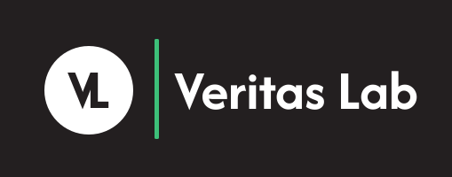

  

 
<h4 align="center" style="none; margin: 0"> in partnership with Naked Insurance </h4>
 

<h2 align="center"> Description </h2>

Veritas Lab is a platform designed to analyze and verify the authenticity of digital media and information. It enables investigators, journalists, and analysts to upload suspicious content and perform advanced forensic analysis to detect manipulation, misinformation, and synthetic media.

 

<h2 align="center"> Documentation and Resources </h2>

[GitHub Project Board](https://github.com/orgs/COS301-SE-2026/projects/71/views/1)

Demo 1

| Resources | Description |
|-----------|-------------|
| [SRS Document](Docs/Demo_1/Veritas-Labs_SRS.pdf) | System Requirement Specification |
| [Style Guide](Docs/Demo_1/Veritas-Labs_BrandStyleGuide.pdf) | Brand Style Guide |
| [Wireframes Doc](Docs/Demo_1/Veritas-Labs_WireframesDoc.pdf) | Wireframes Design Document |
| [Wireframes Figma](Docs/Demo_1/Veritas-Labs_WireframesDemo1.fig) | Wireframes Figma File |

Demo 2

| Resources | Description |
|-----------|-------------|
|[SRS Document](https://github.com/COS301-SE-2026/Veritas-Lab/wiki/Introduction-Demo-2)| Introduction to the SRS Doc|
|[SAS Document](https://github.com/COS301-SE-2026/Veritas-Lab/wiki/Introduction-SAS-DEMO-2)| Introduction to the SAS Doc|
|[Brand Style Guide](Docs/Demo_2/Veritas-Labs_BrandStyleGuide_Demo2.pdf)| Brand Style Guide|
|[Coding Standard Document](https://github.com/COS301-SE-2026/Veritas-Lab/wiki/Coding-Standards-Demo2)| Coding Standard Doc|
|[User Manual](Docs/Demo_2/User-Manual-Veritas-Lab.pdf)| The user manual|
|[Testing Policy](https://github.com/COS301-SE-2026/Veritas-Lab/wiki/Testing-Policy-Document-Demo-2)| Testing Policy Doc|'

Demo 3

| Resources | Description |
|-----------|-------------|
|[SRS Use Case Diagram](https://github.com/COS301-SE-2026/Veritas-Lab/wiki/Use-Case-Diagrams-Demo-3)| Updated use case diagram|
|[SAS Deployment Diagram](https://github.com/COS301-SE-2026/Veritas-Lab/wiki/Deployment-Demo-3)| Updated deployment diagram|
|[SAS Service Contracts](https://veritaslab.app/api/docs)| Service contracts |
|[SAS NFR Testing](https://github.com/COS301-SE-2026/Veritas-Lab/wiki/NFR-Testing-Demo-3)| NFR Testing|
|[SAS NFR Traceability Matrix](https://github.com/COS301-SE-2026/Veritas-Lab/wiki/NFR-Traceability-Matrix-Demo-3)| NFR Traceability Matrix|

 

<h2 align="center"> Technologies Stack </h2>

| Layer | Technology | Icon |
|-----------|-------------|------|
| Frontend | Next.js with React |  |
| Backend | Python, FastAPI |  |
| Search | OpenSearch |  |
| Database | PostgreSQL |  |
| Storage | AWS S3 |  |
| Machine Learning & Computer Vision | Pytorch, OpenCV, Hugging Face |  |
| Caching | Redis |  |
| Queue | Celery | |
| Authentication | Json Web Token |  |
| Deployment | AWS,Docker,GitHubActions |  |
| Testing and Version Control | PyTest, Jest, Playwright, Github |  |

 

<h2 align="center" style="border: none;"> Delta Tech Team </h2> 

<table style="margin: 0 auto 20px; border-collapse: collapse;">
<tr>
    <td style="vertical-align: top; padding: 15px; border: none;">
      <h3 style="margin-top: 0; margin-bottom: 5px;">Byron Pillay</h3>
      <h4 style="margin-top: 0; margin-bottom: 15px; color: #555;">Product Manager, Full Stack Engineer</h4>
    </td>
    <td style="vertical-align: middle; text-align: center; padding: 15px; border: none;">
      
      
    </td>
</tr>

<tr>
    <td style="vertical-align: top; padding: 15px; border: none;">
      <h3 style="margin-top: 0; margin-bottom: 5px;">Mulondi Makhado</h3>
      <h4 style="margin-top: 0; margin-bottom: 15px; color: #555;">UI Designer, Full Stack Engineer</h4>
    </td>
    <td style="vertical-align: middle; text-align: center; padding: 15px; border: none;">
      
      
    </td>
</tr>

<tr>
    <td style="vertical-align: top; padding: 15px; border: none;">
      <h3 style="margin-top: 0; margin-bottom: 5px;">Arran Lamond</h3>
      <h4 style="margin-top: 0; margin-bottom: 15px; color: #555;">Full Stack Engineer</h4>
    </td>
    <td style="vertical-align: middle; text-align: center; padding: 15px; border: none;">
      
      
    </td>
</tr>

<tr>
    <td style="vertical-align: top; padding: 15px; border: none;">
      <h3 style="margin-top: 0; margin-bottom: 5px;">Keegan Lewis</h3>
      <h4 style="margin-top: 0; margin-bottom: 15px; color: #555;">Data Engineer, AI Engineer</h4>
    </td>
    <td style="vertical-align: middle; text-align: center; padding: 15px; border: none;">
      
      
    </td>
</tr>

<tr>
    <td style="vertical-align: top; padding: 15px; border: none;">
      <h3 style="margin-top: 0; margin-bottom: 5px;">Tshepiso Makalana</h3>
      <h4 style="margin-top: 0; margin-bottom: 15px; color: #555;">Data Engineer, AI Engineer</h4>
    </td>
    <td style="vertical-align: middle; text-align: center; padding: 15px; border: none;">
      
      
    </td>
</tr>

</table>

<h2 align="center"> Our Commitment </h2>

We are dedicated to delivering high-quality solutions to our clients with professionalism, efficiency, and attention to detail. Our applications are designed and developed to be secure, reliable, and scalable, ensuring they meet both current requirements and future growth demands.

<h2> Contact </h2>

**Email:** <support.deltatech@gmail.com>

